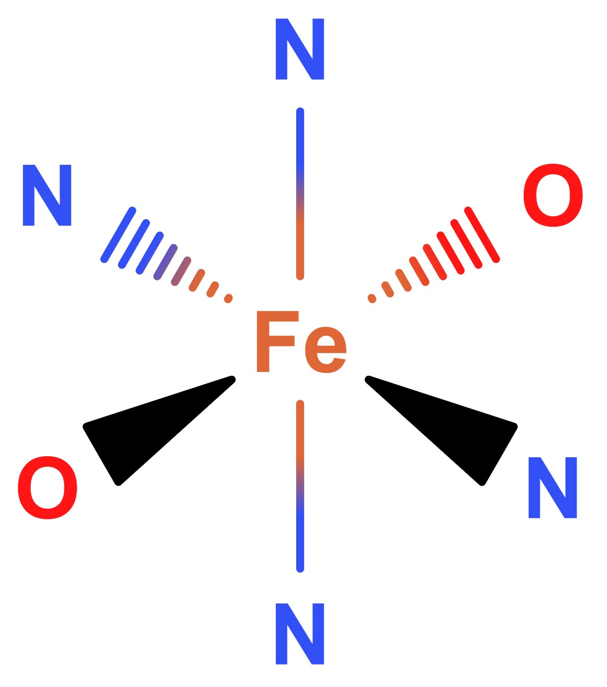
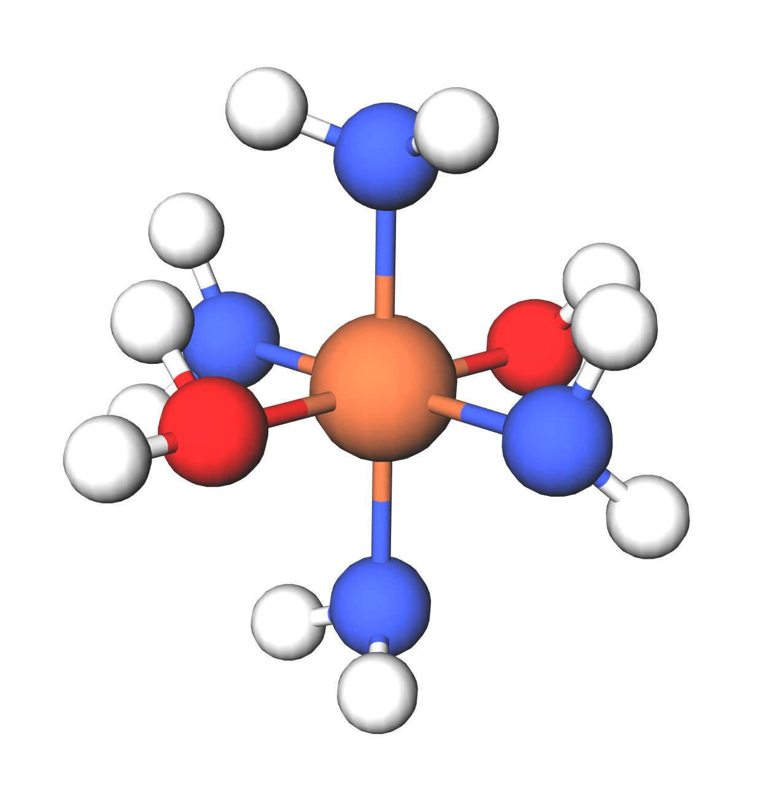
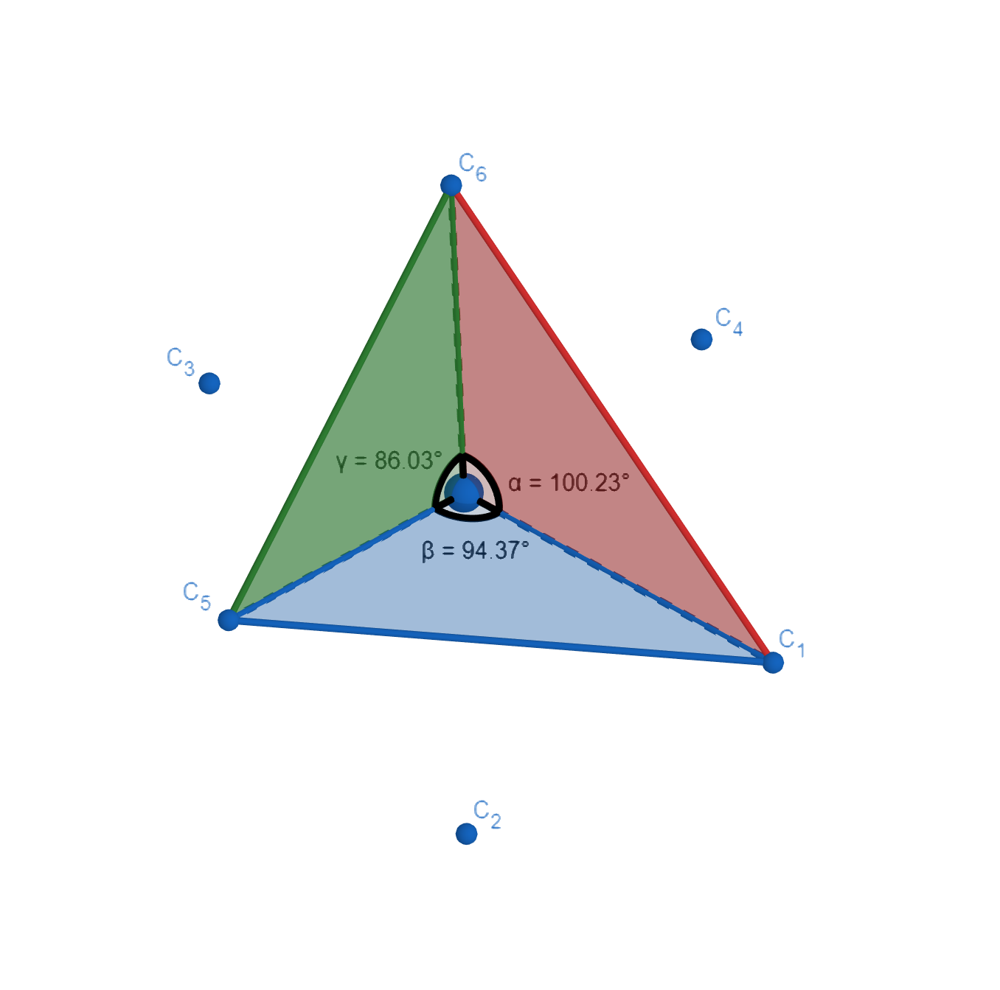
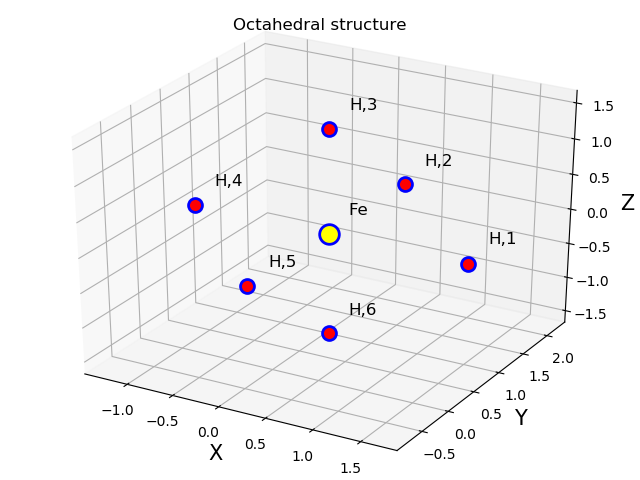
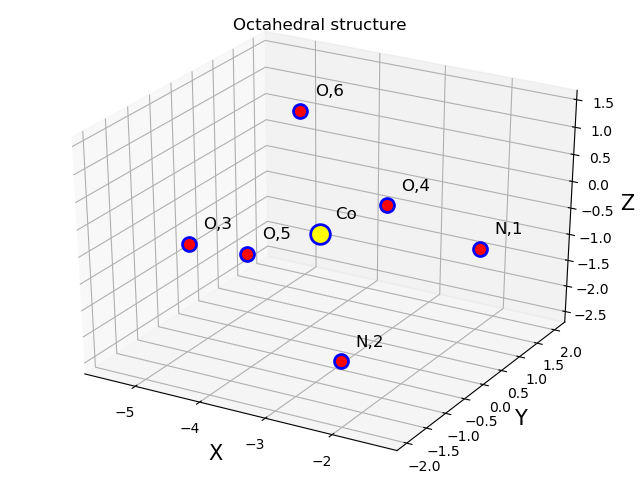
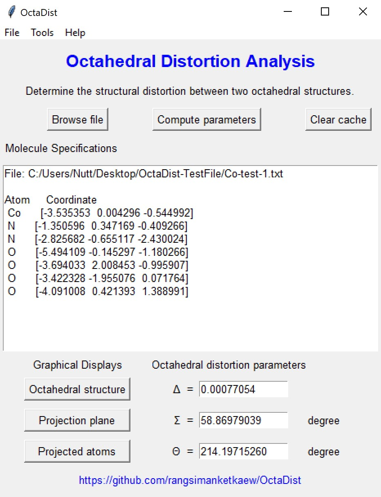
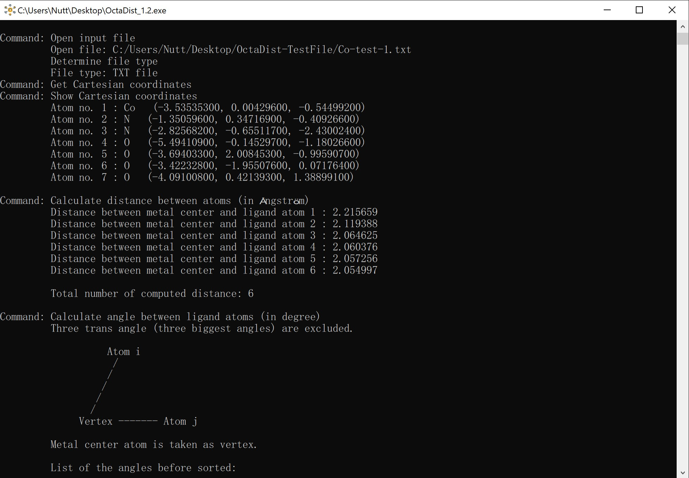

# OctaDist

<p align="center">
   
<p/>

Octahedral Distortion Analysis: determining the structural distortion of octahedral complex. <br/>
This program was written in Python 3.7.2 and tested on PyCharm 2018.3.2 (Community Edition). <br/>
Program executable was compiled by Pyinstaller. <br/>

## Why OctaDist?
### Distortion in Octahedral Geometry

Octahedral complex is composed of 7 atoms: metal center atom and 6 ligand atoms. It has 8 faces, 6 vertices, and 12 edges. It can be simply classified into two types: regular and distorted octahedrons. The complexes with regular octahedral geometry are expected to form, when all of the ligands are of the same kind. In contrast, if the ligands are of different kinds, the complex would turns the distorted octahedron instead. Generally, the structural distion is found in the metal organic framework, the spin-crossover complex, and perovskite structures. 

The following is an example of octahedral structure. 

   Octahedral Fe complex   |   Octahedral Fe complex   
:-------------------------:|:-------------------------:
  |  

### Octahedral Distortion Parameters

#### Purpose
Octahedral distortion parameters have been being widely used in inorganic chemistry and material science to determine the change in stural distortion of metal complex. People in community, mostly chemist and crystallographer, have calculated these parameters for their structures, but not used a certain way to do this. Moreover, there is no software for determining this kind of parameter yet. Therefore, we present the OctaDist program as a choice for those who are interested in this.


#### Calculation of , , and  Parameters 
Mathematical expression of three parameters are given by following equations


<br/>


<br/>

 

- Calculation of the  and  parameters are straightforward. The  is the avearge of the sum of the deviation of LG-M distance, where LG and M are ligand atom and metal center atom, from mean distance. The  is the sum of LG-M-LS angle (  ) from the 90 degree.


   Distortion of Octahedron  |  Cis-Angle ( between metal and ligand atoms   
:-------------------------:|:-------------------------:
  |    


- Unlike,  and , the  is tricky. It is the sum of the deviation of 24 unique LG-M-LG angles () from 60 degree, where  is computed on the orthogonal projection of the two triangular faces of the octahedron projected along its pseudo-threefold axes. The problem is that the projection plane can not be determined directly. To solve this, we propose a method to find the optimal view of plane for further twisting triangular faces. Given three ligand atoms, the plane for atom projection can be defined. The other three ligand atoms on an opposite plane and metal center atom are orthogonally projected onto the given plane. The new location of the atoms on the given plane is called *a projected point*. Then, the unique  angle is computed as an angle between V1 and V2, where V1 and V2 are vectors of atom on below plane (reference atom) and upper planes (a projected atom), and a projected metal center atom is defined as vertex.

Graphical representation of orthogonal projection and twisting planes


   Orthogonal projection onto the opposite plane  |  The  angle between the atom vectors defined by twisting planes   
:-------------------------:|:-------------------------:
  |    


## Usage
### Linux OS
For Linux user, use `python3 -V` to check python version.
1. Download program source code from [this page](https://github.com/rangsimanketkaew/OctaDist/src)
2. Change file permission: `chmod +x OctaDist_V*.py`
3. Execute program: `python OctaDist_V*.py`

### Windows OS
1. Download program executable from [this page](https://github.com/rangsimanketkaew/OctaDist/releases)
2. Right click and select `Run as administrator`
3. Click `Yes`

## Testing
* Perfect octahedral Fe complex ([complex-test-1.txt](test/complex-test-1.xyz))
```
7

Fe                 0.20069808    0.70680627    0.00000000
H                  1.66069808    0.70680627    0.00000000
H                  0.20069808    2.16680627    0.00000000
H                  0.20069808    0.70680627    1.46000000
H                 -1.25930192    0.70680627    0.00000000
H                  0.20069808   -0.75319373    0.00000000
H                  0.20069808    0.70680627   -1.46000000
```

Calculate octahedral distortion parameters
-  = 0.00000000
-  = 0.00000000 degree
-  = 0.00000000 degree

<p align="center">
   
<p/>

---

* XRD structure of octahedral Co complex in low-spin state, provided by David Harding ([complex-test-2.xyz](test/complex-test-2.txt))
```
7

Co                -3.535353      0.004296     -0.544992
N                 -1.350596      0.347169     -0.409266
N                 -2.825682     -0.655117     -2.430024
O                 -5.494109     -0.145297     -1.180266
O                 -3.694033      2.008453     -0.995907
O                 -3.422328     -1.955076      0.071764
O                 -4.091008      0.421393      1.388991
```
Calculate octahedral distortion parameters
-  = 0.00077054
-  = 58.86979039 degree
-  = 144.13959388 degree

<p align="center">
   
<p/>

## Screenshots
<p align="left">
   
   
<p/>

## References
1. J. A. Alonso, M. J. Martı´nez-Lope, M. T. Casais, M. T. Ferna´ndez-Dı´az. Inorg. Chem. 2000, 39, 917-923
2. J. K. McCusker, A. L. Rheingold, D. N. Hendrickson. Inorg. Chem. 1996, 35, 2100.
3. M. Marchivie, P. Guionneau, J. F. Letard, D. Chasseau. Acta Crystal-logr. Sect. B Struct. Sci. 2005, 61, 25.

## Special thanks
I would like to thank
- [Prof. Yuthana Tantirungrotechai](https://sites.google.com/site/compchem403/people/faculty/yuthana) (Thammasat University, Thailand)
- [Prof. David J. Harding](https://www.funtechwu.com/david-j-harding) (Walailak University, Thailand)

for useful advices and comments.

## Author
Rangsiman Ketkaew (Master Student) <br/>
Computational Chemistry Research Unit <br/>
Department of Chemistry, Faculty of Science and Technology <br/>
Thammasat University, Pathum Thani, 12120 Thailand <br/>
E-mail: [rangsiman1993@gmail.com](rangsiman1993@gmail.com)
Website: [https://sites.google.com/site/rangsiman1993](https://sites.google.com/site/rangsiman1993)
