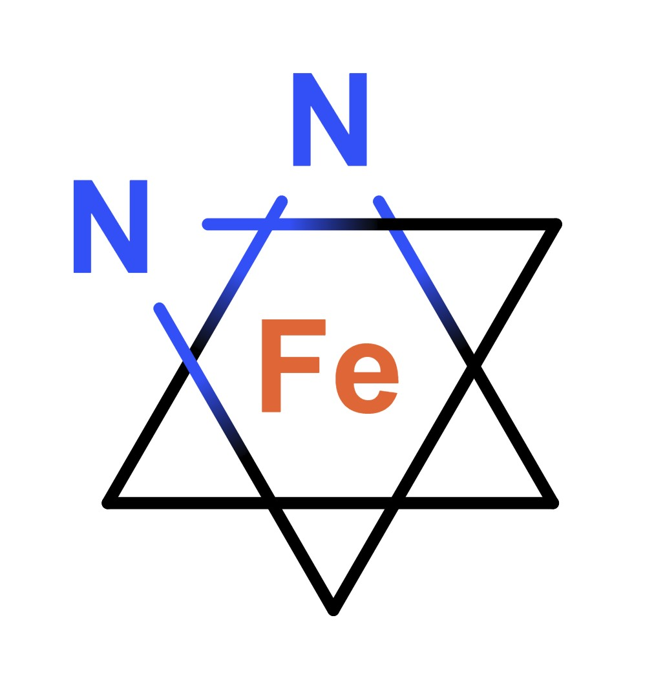

# OctaDist
Octahedral Distortion Analysis: determining the structural distortion of octahedral complex. <br/>
This program was written in Python 3.7.2 and tested on PyCharm 2018.3.2 (Community Edition). <br/>
Program executable was compiled by Pyinstaller. <br/>

## Background
### Distortion in Octahedral Geometry

Octahedral structure is composed of 7 atoms: metal center atom and 6 ligand atoms. It has 8 faces, 6 vertices, and 12 edges. It can be simply classified into two types: regular and distorted octahedrons. The complexes with regular octahedral geometry are expected to form, when all of the ligands are of the same kind. In contrast, if the ligands are of different kinds, the complex would turns the distorted octahedron instead.

The following is an example of octahedral structure. 

   Octahedral Fe complex   |   Octahedral Fe complex   
:-------------------------:|:-------------------------:
  |  

### Octahedral Distortion Parameters

Octahedral distortion paramers have been widely used to determine the structural distortion of synthesized metal complex such as metal organic framework (MOF), spin-crossover (SCO) complex, and perovskite cstructure. Previous publications have determined the octahedral distortion using structural parameters: , , and , given by following equations

- 

- 

-  

However, there is no program for determining this kind of parameter yet. So we present the OctaDist program as a choice for those who are interested in this.


### Methods
#### Calculation of  and  Parameters
Calculation of the  and  parameters are straightforward. The  is the avearge of the sum of the deviation of LG-M distance, where LG and M are ligand atom and metal center atom, from mean distance. The  is the sum of LG-M-LS angle (  ) from the 90 degree. 

#### Calculation of  Parameter
Determining the  is tricky. It is the sum of the deviation of 24 LG-M-LG angles (  ) from 60 degree. The size of  angle depends on how the two twisting planes are defined. Given any three ligand atoms, the plane for orthogonal projection is defined. The other three ligand atoms are projected onto the orthogonal plane. The new location of the ligand atoms on the given plane is called a projected point. Then, we can compute the angle between the vector of which projected point of two atoms (ray 1 and ray 2), a metal center atom is defined as vertex. 

<p align="center">
    
<p/>

Ligand atoms on the same twisting plane.

<p align="center">
   
<p/>

Following is step-by-step procedure we use to calculate the  parameter

```
Determine 24 angles
        1. Suppose that we have an octahedron composed of one metal center atom (m)
            and six ligand atoms of which index 1-6.

                        1
                    4  /\  6
                     \/  \/
                     /\  /\
                    3  \/  5
                       2

            m is absent.

        2. Given three atom (vertex) of triangular plane, i.e.

            [1, 3, 5]

            So the rest are on the opposite plane,

            [2, 4, 6]

        3. Orthogonally project [2, 4, 6] onto the plane that defined by [1, 3, 5]

            [2, 4, 6] -----> [2', 4', 6']
                    [1, 3, 5]

        4. Determine the minimum distance from atom on the plane ([1, 3, 5]) to the line that
            pass through two points of projected atoms ([2', 4', 6'])

            d1 = atom 1 to line 2'---4'
            d2 = atom 1 to line 4'---6'
            d3 = atom 1 to line 2'---6'

            What if d2 is the shortest distance, so the atom 1 is between projected atoms 4' and 6'

        5. Subtract vector of ligand atoms by projected metal center (m'). this yields three adjacent rays

            ray1 = 4' - m'
            ray2 = 1 - m'
            ray3 = 6' - m'

        6. Calculate the angle between the rays

            ray2 and ray1 --yields--> angle1
            ray2 and ray3 --yields--> angle2

        7. Repeat step (2) - (6) with changing the plane and reference atoms.
            We defined four planes. Each plane gives 6 angles.
            Eventually, the total number of angles is 24.

        8. Calculate Theta parameter, it is the sum of the deviation of angle from 60 degree.

            Theta = \sum_{1}_{24} abs(60 - angle_i)
            
```

## Usage
### Linux OS
For Linux user, use `python3 -V` to check python version.
1. Download program source code from [this page](https://github.com/rangsimanketkaew/OctaDist/src)
2. Change file permission: `chmod +x OctaDist_V*.py`
3. Execute program: `python OctaDist_V*.py`

### Windows OS
1. Download program executable from [this page](https://github.com/rangsimanketkaew/OctaDist/releases)
2. Right click and select `Run as administrator`
3. Click `Yes`

## Testing
* Perfect octahedral Fe complex ([complex-test-1.txt](test/complex-test-1.txt))
```
Fe                 0.20069808    0.70680627    0.00000000
H                  1.66069808    0.70680627    0.00000000
H                  0.20069808    2.16680627    0.00000000
H                  0.20069808    0.70680627    1.46000000
H                 -1.25930192    0.70680627    0.00000000
H                  0.20069808   -0.75319373    0.00000000
H                  0.20069808    0.70680627   -1.46000000
```

Calculate octahedral distortion parameters
- Delta  <> = 0.00000000
- Sigma  <> = 0.00000000 degree
- Theta  <> = 0.00000000 degree

<p align="center">
   
<p/>

---

* XRD structure of octahedral Co complex in low-spin state, provided by David Harding ([complex-test-2.xyz](test/complex-test-2.txt))
```
Co                -3.535353      0.004296     -0.544992
N                 -1.350596      0.347169     -0.409266
N                 -2.825682     -0.655117     -2.430024
O                 -5.494109     -0.145297     -1.180266
O                 -3.694033      2.008453     -0.995907
O                 -3.422328     -1.955076      0.071764
O                 -4.091008      0.421393      1.388991
```
Calculate octahedral distortion parameters
- Delta  <> = 0.00077054
- Sigma  <> = 58.86979039 degree
- Theta  <> = 144.13959388 degree

<p align="center">
   
<p/>

## Screenshots
<p align="left">
   
   
<p/>

## References
1. J. A. Alonso, M. J. Martı´nez-Lope, M. T. Casais, M. T. Ferna´ndez-Dı´az. Inorg. Chem. 2000, 39, 917-923
2. J. K. McCusker, A. L. Rheingold, D. N. Hendrickson. Inorg. Chem. 1996, 35, 2100.
3. M. Marchivie, P. Guionneau, J. F. Letard, D. Chasseau. Acta Crystal-logr. Sect. B Struct. Sci. 2005, 61, 25.

## Special thanks
I would like to thank
- [Prof. Yuthana Tantirungrotechai](https://sites.google.com/site/compchem403/people/faculty/yuthana) (Thammasat University, Thailand)
- [Prof. David J. Harding](https://www.funtechwu.com/david-j-harding) (Walailak University, Thailand)

for useful advices and comments.

## Author
Rangsiman Ketkaew (Master Student) <br/>
Computational Chemistry Research Unit <br/>
Department of Chemistry, Faculty of Science and Technology <br/>
Thammasat University, Pathum Thani, 12120 Thailand <br/>
E-mail: [rangsiman1993@gmail.com](rangsiman1993@gmail.com)
Website: [https://sites.google.com/site/rangsiman1993](https://sites.google.com/site/rangsiman1993)
