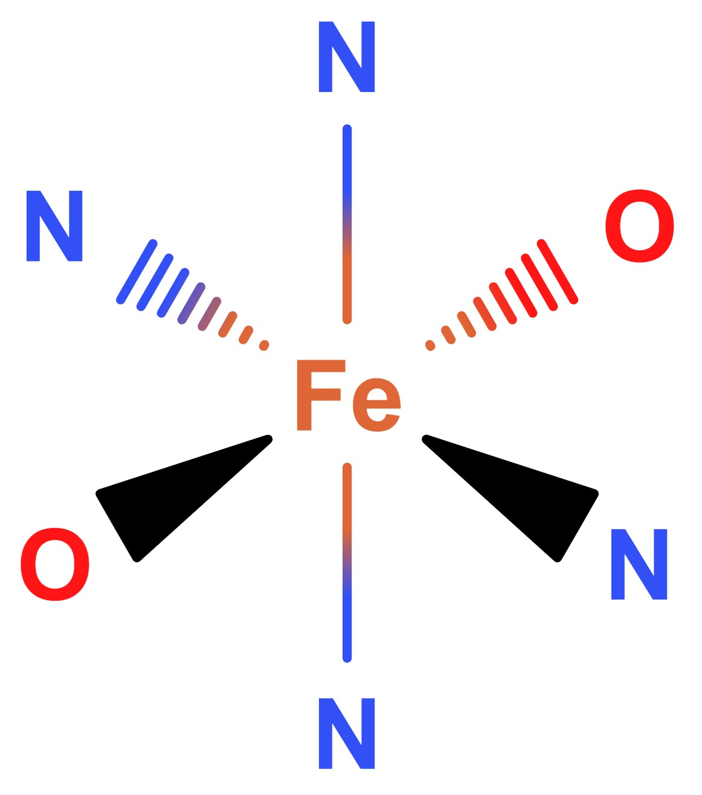
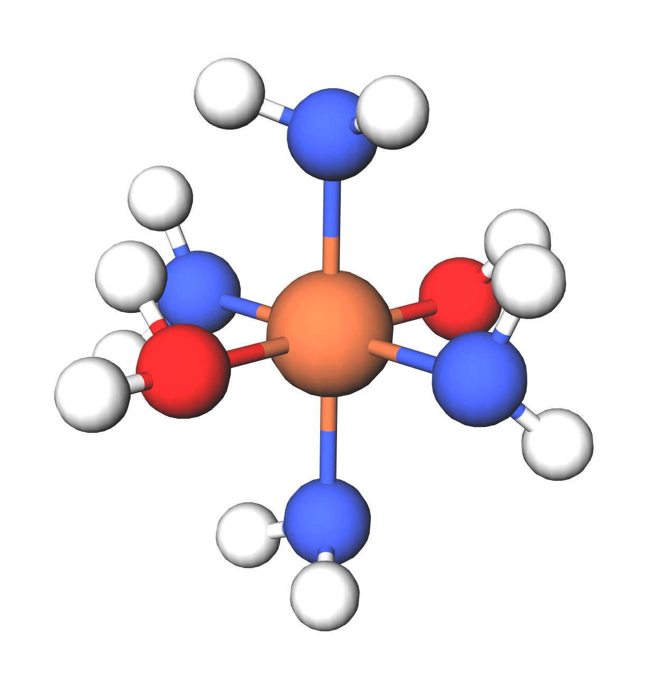
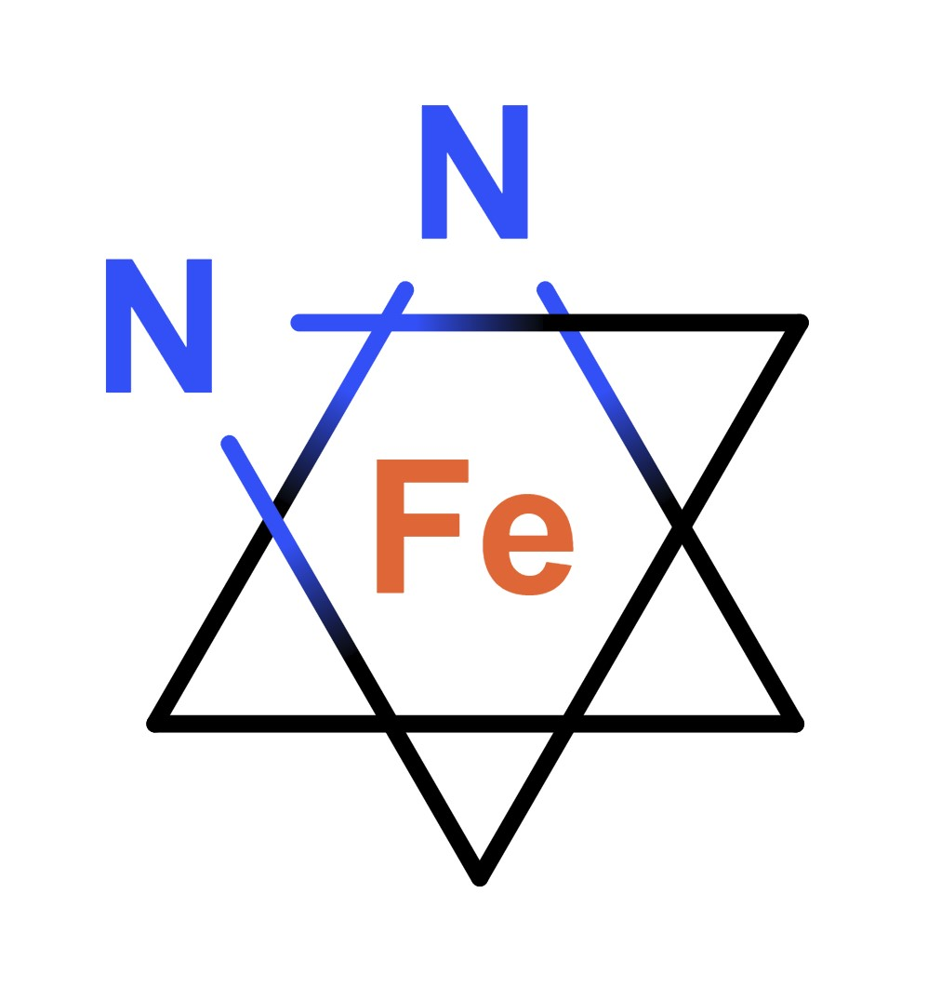
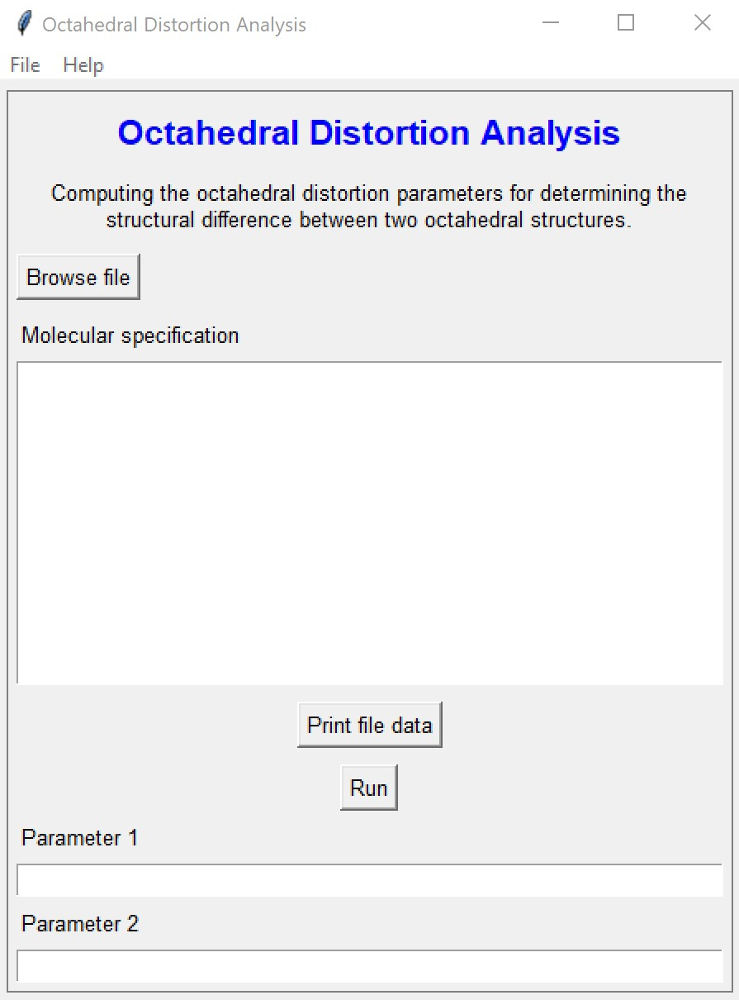
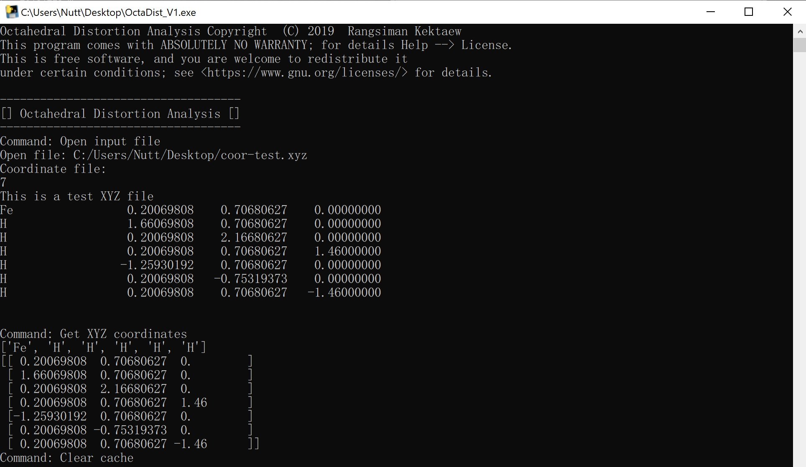

# OctaDist
Octahedral Distortion Analysis: determining the structural distortion of octahedral complex.  
This program was written in Python 3.7.2 and tested on PyCharm 2018.3.2 (Community Edition).  

## Background
### Octahedral Distortion Parameters
Octahedral structure is composed of 7 atoms: one metal center atom and six ligand atoms. It has eqight faces, 6 vertices, and 12 edges.
The structural distortion generally occurs in octahedral complex. Previous publications have determined the octahedral distortion using structural parameters: , , and , given by following equations

- 

- 

-  

2D structure of octahedral Fe complex |  3D structure of octahedral Fe complex  | Projection of ligand atoms onto the twisting plane
:-------------------------:|:-------------------------:|:-------------------------:
         |         |  

### Methods
#### Orthogonal projection
Calculation of the  and  parameters are straightforward, but the  is tricky becuase the  angle depends on how the two twisting planes are defined. Given three ligand atoms, we can find the plane for orthogonal projection of other ligan atoms onto the plane. The location of the ligand atoms on the given plane are called a projected point. Then, we compute the angle between the vector of a projected point of two atoms (ray 1 and ray 2), which a projected metal center is taken as vertex. 

    

## Usage
### Linux OS
For Linux user, use `python3 -V` to check python version.
1. Download program source code from [this page](https://github.com/rangsimanketkaew/OctaDist)
2. Change file permission: `chmod +x OctaDist_V*.py`
3. Execute program: `python OctaDist_V*.py`

### Windows OS
1. Download program executable from [this page](https://github.com/rangsimanketkaew/OctaDist/releases)
2. Right click and select `Run as administrator`
3. Click `Yes`

## Screenshots

   
   

## Author
Rangsiman ketkaew  
Computational Chemistry Research Unit  
Department of Chemistry, Faculty of Science and Technology  
Thammasat University, Pathum Thani, 12120 Thailand  
E-mail: [rangsiman1993@gmail.com](rangsiman1993@gmail.com)
Website: [https://sites.google.com/site/rangsiman1993](https://sites.google.com/site/rangsiman1993)
