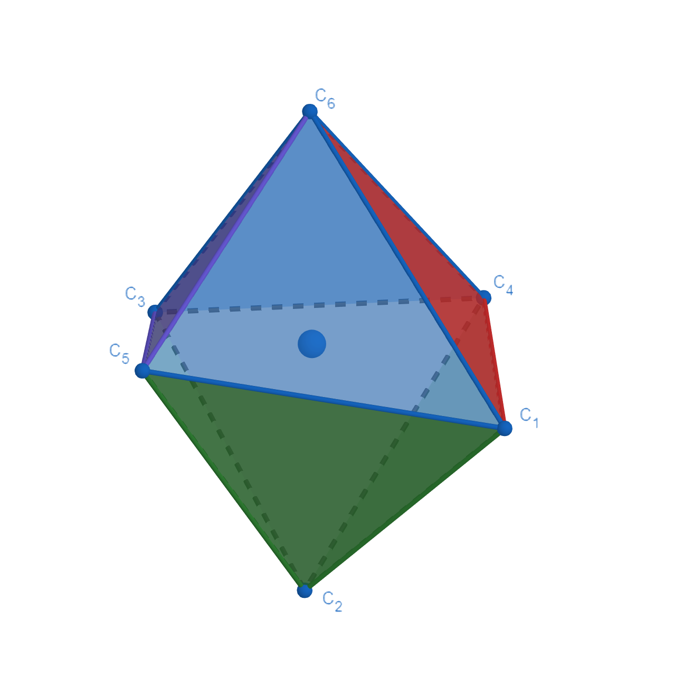
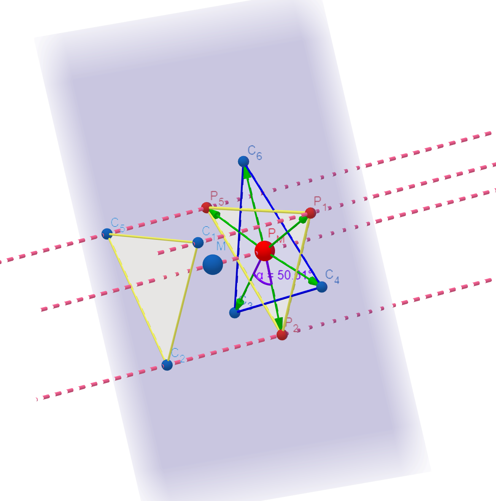
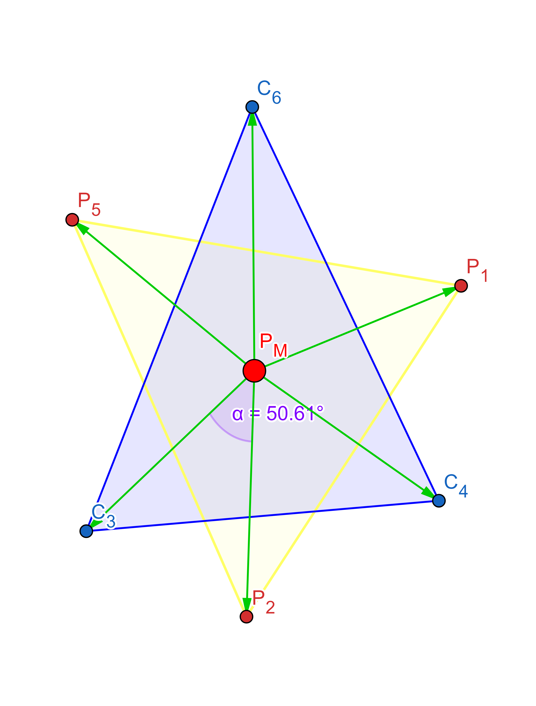
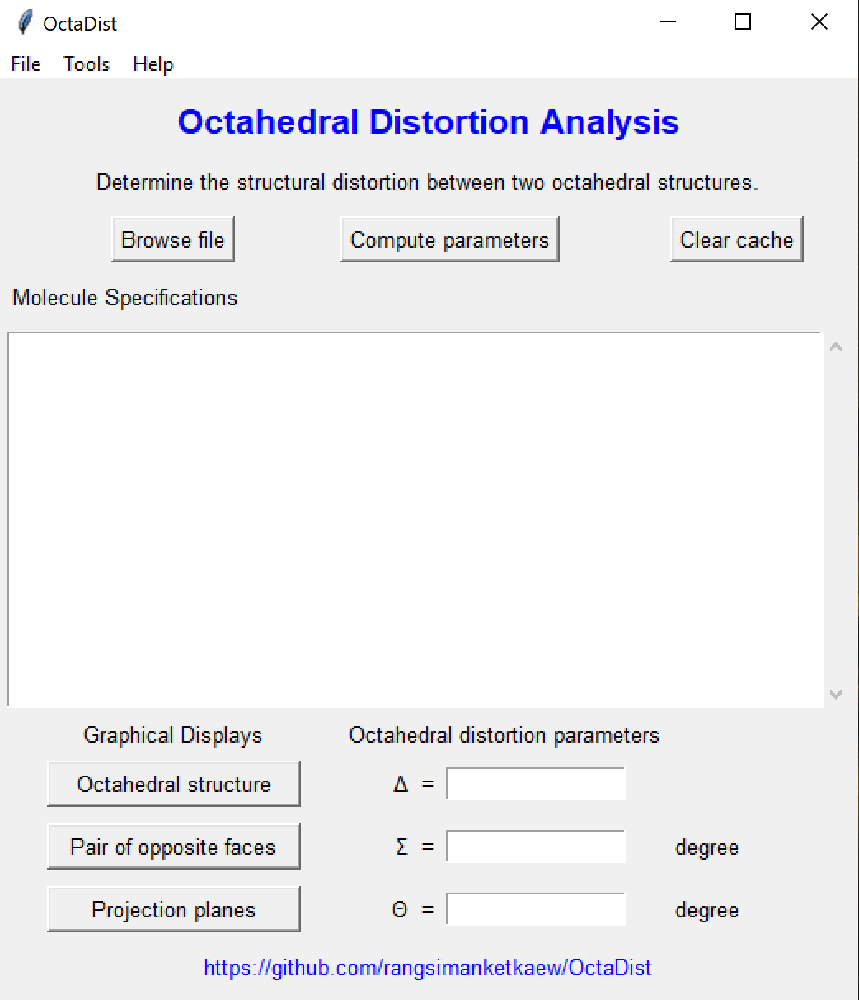
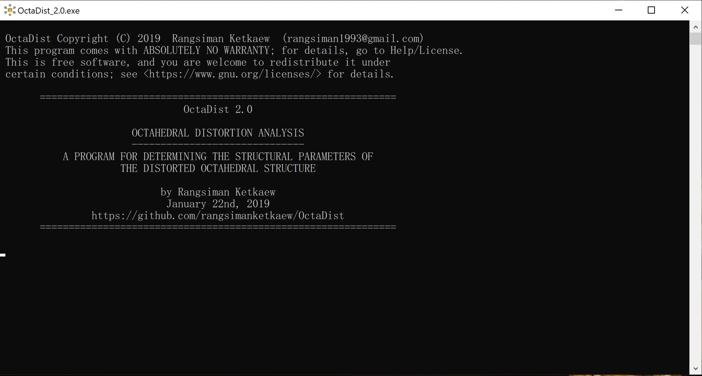
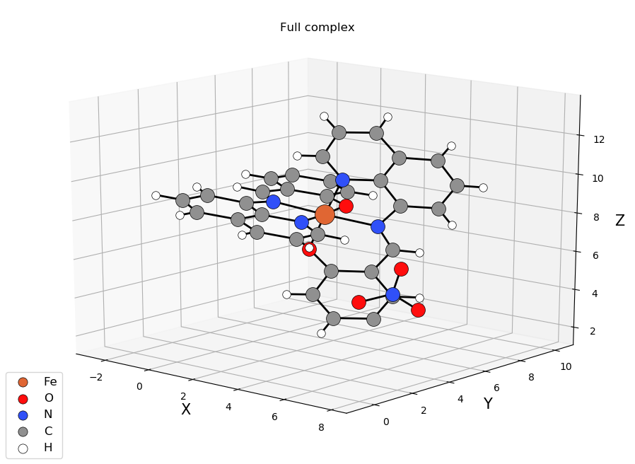
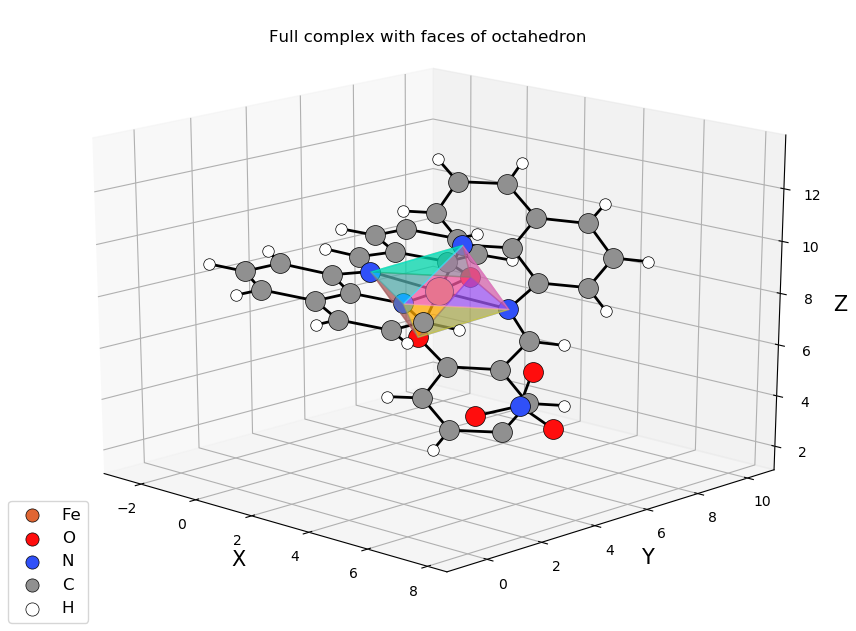
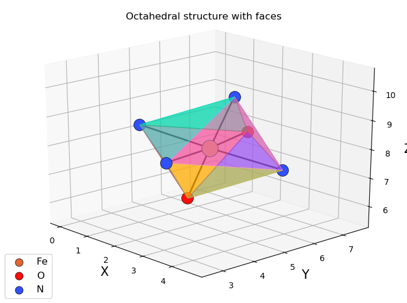
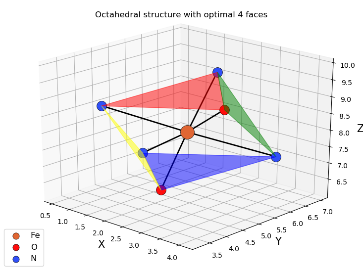

[](https://travis-ci.org/rangsimanketkaew/OctaDist)
[](https://github.com/rangsimanketkaew/OctaDist/releases)
[](https://github.com/rangsimanketkaew/OctaDist)
[](https://github.com/rangsimanketkaew/OctaDist)
[](https://github.com/rangsimanketkaew/OctaDist/releases)
[](https://github.com/rangsimanketkaew/OctaDist/releases/tag/v.2.1)

# OctaDist

<p align="center">
   
<p/>

Octahedral Distortion Analysis: determining the structural distortion of octahedral complex. <br/>
This program was written in Python 3.7.2 and tested on PyCharm 2018.3.2 (Community Edition). <br/>
Program executable was compiled by Pyinstaller. <br/>

[**Click here**](https://github.com/rangsimanketkaew/OctaDist/releases/tag/v.2.1) to download the stable version of OctaDist 2.1 for Windows systems, Mac OS, and GNU/Linux OS

## Why OctaDist?
### Distortion in Octahedral Geometry

Octahedral complex is composed of 7 atoms: metal center atom and 6 ligand atoms. It has 8 faces, 6 vertices, and 12 edges. It can be simply classified into two types: regular and distorted octahedrons. The complexes with regular octahedral geometry or perfect octahedron are expected to form, when all of the ligands are of the same kind. In contrast, if the ligands are of different kinds, the complex would turns the distorted octahedron instead. Generally, the structural distortion is found in the [metal-organic framework](https://en.wikipedia.org/wiki/Metal%E2%80%93organic_framework), the [spin-crossover complex](https://en.wikipedia.org/wiki/Spin_crossover), and [perovskite structures](https://en.wikipedia.org/wiki/Perovskite_(structure)).

### Purpose
Octahedral distortion parameters have been being widely used in inorganic cheemistry, especially crystallography, for determining the structural distortion of octahedral metal complex. Even though the people in community generally compute these parameters for their synthesized complex, but they not used a certain way to do this. Moreover, there is no software for determining this kind of parameter yet. Therefore, we present the OctaDist program as a choice for those who are interested in this.

### Octahedral Distortion Parameters
Octahedral distortion parameters contain three parameters: , , and . The following just explains how to compute these three parameters, especially we use our new method to compute the  parameter. Please refer to [References](#references) for more details.

- Calculation of the  and  parameters are straightforward. The  is the avearge of the sum of the deviation of LG-M distance, where LG and M are ligand atom and metal center atom, from mean distance. The  is the sum of LG-M-LS angle (  ) from the 90 degree.

- The  parameter is the sum of the deviation of 24 unique LG-M-LG angles () from 60 degree, where  is computed on the orthogonal projection of two twisting triangular faces of the octahedron projected along its pseudo-threefold axes onto the medium plane that containing metal center. However, in reality, becuase of the complex is distorted, the symmetry is changed, so the medium plane between two opposite faces cannot be determined directly. To solve this, we propose a new method to find the optimal 4 faces and use orthogonal vector projection for computing the unique () angles on twisting triangular faces, and for finding the most reasonable  parameter.

Mathematical expression of three parameters are given by following equations


<br/>


<br/>

 

- To find the optimal 4 planes (faces), OctaDist firstly chooses 4 faces out of 8 faces of complex. The total number of combination is 70. Then OctaDist computes the 24 unique () angles for all 70 sets of planes and computes the 70 different values of  parameter. The lowest value is chosen as a minimum  parameter representing the distortion of the octahedral metal complex.

**Graphical representation of orthogonal projection and twisting triangular faces**

Distorted octahedron | Orthogonal projection of atoms onto the given (opposite) plane | The  angle between the atom vectors defined by two twisting triangular faces   
:-------------------------:|:-------------------------:|:-------------------------:
 |  |    

<br/>

## Usage
### Windows OS
1. Download program executable from [this page](https://github.com/rangsimanketkaew/OctaDist/releases)
2. Right click and select `Run as administrator`
3. Click `Yes`
4. Wait program for process until open

### Mac OS X
1. Download program source code from [this page](https://github.com/rangsimanketkaew/OctaDist/releases)
2. Uncompress the tarball: `tar -xzvf OctaDist-*`
3. Enter OctaDist directory: `cd OctaDist-*/src`
4. Change file permission of all python files: `chmod +x *.py`
5. Compile executable using PyInstaller: `pyinstaller --onefile main.py`

### Linux OS
For Linux user, use `python3 -V` to check python version.
1. Download program source code from [this page](https://github.com/rangsimanketkaew/OctaDist/src)
2. Uncompress the tarball: `tar -xzvf OctaDist-*`
3. Enter OctaDist directory: `cd OctaDist-*/src`
4. Change file permission of all python files: `chmod +x *.py`
5. Execute program: `python3 main.py`

### Required module

```
numpy==1.16.0
matplotlib==3.0.2
PyInstaller==3.4
tkinter
matplotlib
```

### Supported input file format
- [XYZ file format](https://en.wikipedia.org/wiki/XYZ_file_format) (*.xyz)
- Text file format (*.txt)
- Output file of several computational chemistry programs (*.out, *.log): Gaussian, NWChem, and ORCA

### Input preparation
The current version of OctaDist only supports the cartesian (XYZ) coordinate file (see [Testing](#testing)) <br/>
**1. First seven atoms must be the studied octahedral structure.** <br/>
**2. A metal center atom of octahedron must be the first atom. So the next six atoms would be six ligand atoms.**

## Testing

* Perfect octahedral metal complex ([Perfect-octahedron.xyz](test/Perfect-octahedron.xyz))

Calculate octahedral distortion parameters
-  = 0.00000000
-  = 0.00000000 degree
-  = 0.00000000 degree

<details>
<summary> Click here to see the coordinates</summary>

```
7

Fe                 0.20069808    0.70680627    0.00000000
H                  1.66069808    0.70680627    0.00000000
H                  0.20069808    2.16680627    0.00000000
H                  0.20069808    0.70680627    1.46000000
H                 -1.25930192    0.70680627    0.00000000
H                  0.20069808   -0.75319373    0.00000000
H                  0.20069808    0.70680627   -1.46000000
```

</details>

---

* XRD structure of [Fe(1-bpp)2][BF4]2 complex in low-spin state, taken from Malcolm Halcrow's CCDC library ([[Fe(1-bpp)2][BF4]2-LS-Full.xyz](test/[Fe(1-bpp)2][BF4]2-LS-Full.xyz))

Calculate octahedral distortion parameters
-  = 0.000348
-  = 86.081494 degree
-  = 271.388567 degree

<details>
<summary> Click here to see the coordinates</summary>

```
51
[Fe(1-bpp)2][BF4]2-LS-Full
Fe                 4.06740000    7.20400000   13.61170000
N                  4.30330000    7.37500000   11.72920000
N                  2.31840000    8.01650000   13.11520000
N                  5.88220000    6.44610000   13.43120000
N                  3.83260000    6.97150000   15.49260000
N                  4.80550000    8.93180000   14.27160000
N                  3.30020000    5.38280000   13.63160000
C                  3.32570000    7.88480000   10.96510000
C                  3.43510000    8.00970000    9.58920000
H                  2.73580000    8.37830000    9.06250000
C                  4.63370000    7.56230000    9.01840000
H                  4.74970000    7.63420000    8.07790000
C                  5.65940000    7.01570000    9.78100000
H                  6.46920000    6.71470000    9.38710000
C                  5.43880000    6.93450000   11.15020000
N                  2.22100000    8.25180000   11.75890000
C                  1.15110000    8.42450000   13.62940000
H                  0.92390000    8.38350000   14.55110000
C                  0.30430000    8.92410000   12.61430000
H                 -0.57080000    9.27650000   12.72400000
C                  1.00220000    8.79660000   11.43760000
H                  0.69950000    9.03960000   10.57050000
N                  6.30750000    6.38700000   12.11440000
C                  6.84280000    5.85930000   14.13390000
H                  6.83070000    5.75320000   15.07810000
C                  7.88870000    5.41110000   13.28930000
H                  8.68530000    4.96540000   13.55190000
C                  7.51650000    5.75150000   12.01650000
H                  8.00390000    5.58040000   11.21970000
C                  4.21100000    7.93100000   16.34690000
C                  4.08120000    7.80100000   17.72300000
H                  4.34890000    8.49130000   18.31840000
C                  3.53430000    6.59920000   18.18980000
H                  3.42420000    6.47340000   19.12430000
C                  3.14630000    5.58390000   17.31980000
H                  2.78150000    4.76780000   17.64000000
C                  3.31780000    5.81990000   15.96650000
N                  4.75750000    9.02590000   15.65690000
C                  5.42180000   10.03780000   13.86440000
H                  5.59430000   10.25590000   12.95560000
C                  5.78680000   10.84870000   14.97180000
H                  6.23910000   11.68350000   14.94680000
C                  5.35100000   10.17460000   16.08810000
H                  5.44530000   10.45600000   16.99090000
N                  3.00400000    4.94490000   14.90920000
C                  3.00790000    4.35980000   12.83430000
H                  3.11840000    4.36580000   11.89070000
C                  2.51300000    3.26320000   13.57170000
H                  2.23080000    2.42240000   13.23090000
C                  2.52450000    3.66700000   14.88790000
H                  2.25040000    3.15370000   15.63790000

```

</details>

---

* XRD structure of [Fe(1-bpp)2][BF4]2 complex in high-spin state, taken from Malcolm Halcrow's CCDC library ([[Fe(1-bpp)2][BF4]2-HS-Full.xyz](test/[Fe(1-bpp)2][BF4]2-HS-Full.xyz))

Calculate octahedral distortion parameters
-  = 0.000168
-  = 150.814795 degree
-  = 469.590198 degree

<details>
<summary> Click here to see the coordinates</summary>

```
51
[Fe(1-bpp)2][BF4]2-HS-Full
Fe                 4.90490000    6.91350000   14.24800000
N                  4.98220000    6.87650000   12.11090000
N                  2.95710000    7.67330000   13.54390000
N                  4.67140000    6.74120000   16.36850000
N                  6.85350000    6.08640000   13.70170000
N                  5.68300000    8.77920000   15.10820000
N                  4.10760000    4.89840000   14.64310000
C                  3.95110000    7.34120000   11.39040000
C                  3.96790000    7.39090000    9.99990000
H                  3.24140000    7.70930000    9.51520000
C                  5.12240000    6.94150000    9.36990000
H                  5.17300000    6.96380000    8.44210000
C                  6.19930000    6.45960000   10.09670000
H                  6.97470000    6.16260000    9.67910000
C                  6.06580000    6.44250000   11.47410000
N                  2.85780000    7.75980000   12.17480000
C                  1.78900000    8.12950000   14.00140000
H                  1.56160000    8.18350000   14.90180000
C                  0.94950000    8.51730000   12.94770000
H                  0.09230000    8.87160000   13.01670000
C                  1.64550000    8.26900000   11.80190000
H                  1.35200000    8.41800000   10.93140000
N                  7.06320000    5.96320000   12.35070000
C                  7.90470000    5.49240000   14.26540000
H                  8.04400000    5.42910000   15.18200000
C                  8.77020000    4.97630000   13.29880000
H                  9.56660000    4.51930000   13.44740000
C                  8.20860000    5.28020000   12.08800000
H                  8.54430000    5.06110000   11.24970000
C                  5.03250000    7.74860000   17.16910000
C                  4.88910000    7.70330000   18.55180000
H                  5.14250000    8.41630000   19.09330000
C                  4.34870000    6.54350000   19.08240000
H                  4.23050000    6.47760000   20.00250000
C                  3.98030000    5.48050000   18.27800000
H                  3.62870000    4.69640000   18.63580000
C                  4.16090000    5.64140000   16.91650000
N                  5.59200000    8.84510000   16.47680000
C                  6.30310000    9.90980000   14.75750000
H                  6.50150000   10.15040000   13.88200000
C                  6.61580000   10.68700000   15.88340000
H                  7.05020000   11.50870000   15.89870000
C                  6.14730000    9.98350000   16.94930000
H                  6.19860000   10.24020000   17.84100000
N                  3.82500000    4.65280000   15.95530000
C                  3.73140000    3.80030000   13.98740000
H                  3.81770000    3.68050000   13.07000000
C                  3.18990000    2.85710000   14.85780000
H                  2.84890000    2.02000000   14.64070000
C                  3.26630000    3.43140000   16.11790000
H                  2.98720000    3.05050000   16.91840000

```

</details>


## Screenshots

Program UI | Console window |
:-------------------------:|:-------------------------:
   |  

**Display of full complex and selected octahedron**

Full complex | Full complex with faces of octahedron |
:-------------------------:|:-------------------------:
   |  
**Selected octahedral structure** | **Optimal 4 faces** 
  | 

## References
1. [J. A. Alonso, M. J. Martı´nez-Lope, M. T. Casais, M. T. Ferna´ndez-Dı´az. Inorg. Chem. 2000, 39, 917-923](https://pubs.acs.org/doi/abs/10.1021/ic990921e)
2. [J. K. McCusker, A. L. Rheingold, D. N. Hendrickson. Inorg. Chem. 1996, 35, 2100-2112](https://pubs.acs.org/doi/abs/10.1021/ic9507880)
3. [M. Marchivie, P. Guionneau, J. F. Letard, D. Chasseau. Acta Crystal-logr. Sect. B Struct. Sci. 2005, 61, 25-28](https://onlinelibrary.wiley.com/doi/full/10.1107/S0108768104029751)

## Special thanks
I would like to thank

- [Prof. Yuthana Tantirungrotechai](https://sites.google.com/site/compchem403/people/faculty/yuthana) (Thammasat University, Thailand)
- [Prof. David J. Harding](https://www.funtechwu.com/david-j-harding) (Walailak University, Thailand)

for useful advices and comments.

## Author
Rangsiman Ketkaew<br/>
Computational Chemistry Research Unit <br/>
Department of Chemistry, Faculty of Science and Technology <br/>
Thammasat University, Pathum Thani, 12120 Thailand <br/>
E-mail: [rangsiman1993@gmail.com](rangsiman1993@gmail.com) <br/>
Website: [https://sites.google.com/site/rangsiman1993](https://sites.google.com/site/rangsiman1993)
