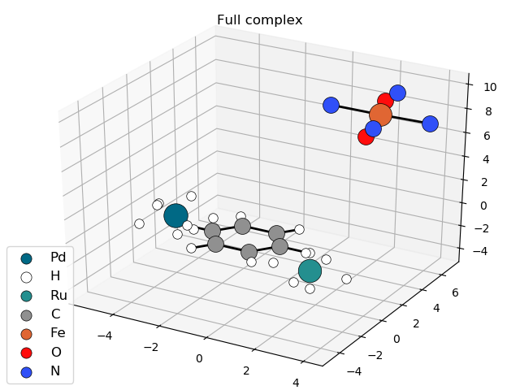

=========
Example 6
=========

**Example 6 for running the test on OctaDist PyPI**

.. code-block:: python

    import os
    import octadist as oc

    dir_path = os.path.dirname(os.path.realpath(__file__))
    input_folder = os.path.join(dir_path, "../example-input/")
    file = input_folder + "Multiple-metals.xyz"

    atom_full, coord_full = oc.io.extract_coord(file)

    # Display and automatically save image as .png file with user-specified name
    my_plot = oc.draw.DrawComplex_Matplotlib(atom=atom_full, coord=coord_full)
    my_plot.add_atom()
    my_plot.add_bond()
    my_plot.add_legend()
    my_plot.save_img()
    my_plot.show_plot()

    # Output image, Complex_saved_by_OctaDist.png, is stored at ../images directory

    Snapshot of structure saved by OctaDist.

